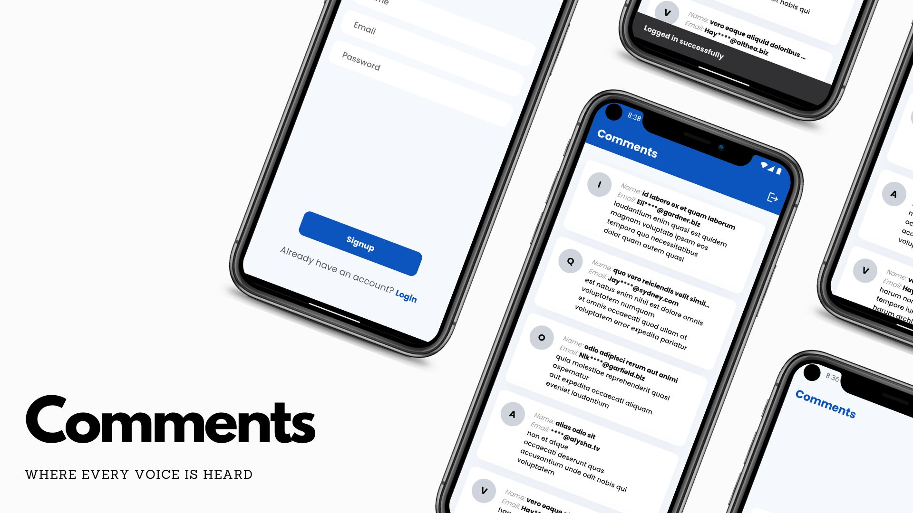
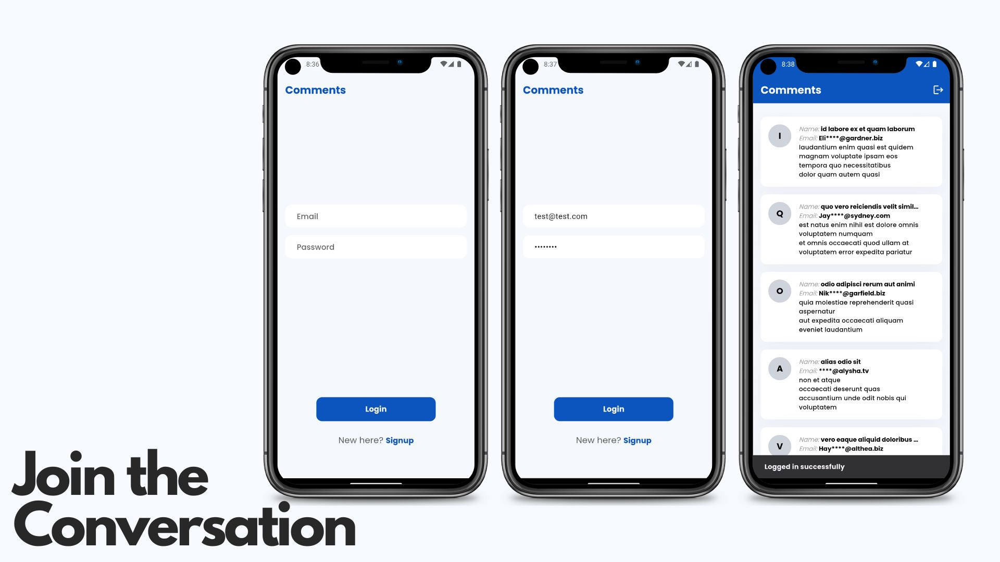
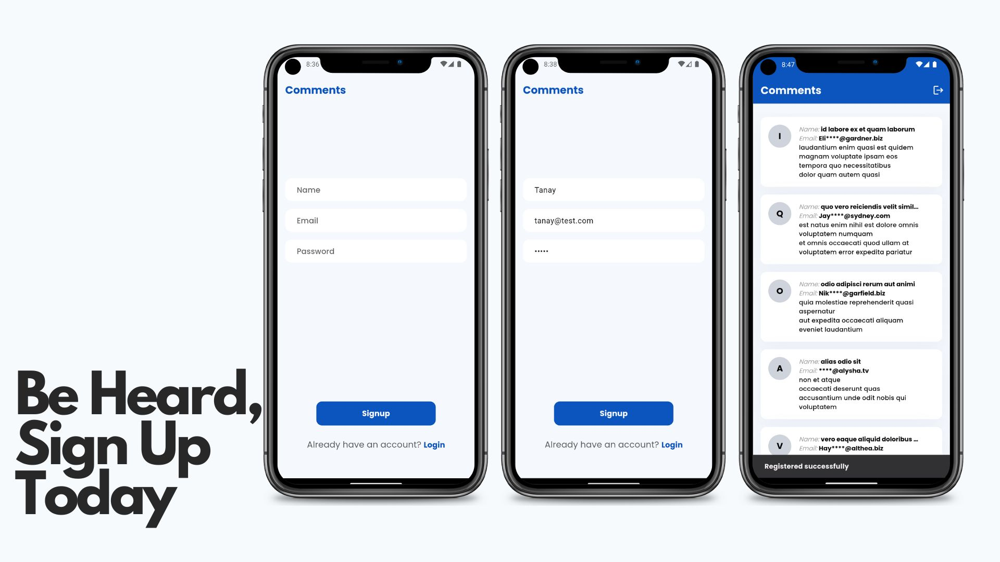
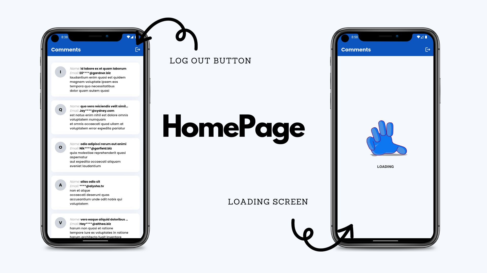
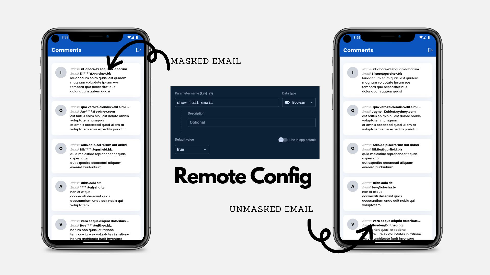
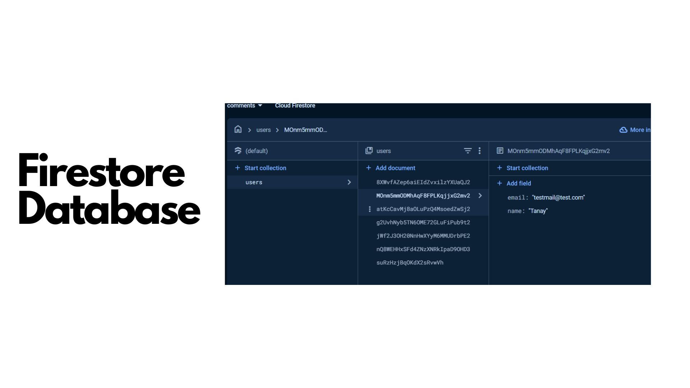

#Flutter Assignment

The Challenge was to build a Flutter comments app which uses Firebase Authentication, Firebase Remote Config, and will fetch comments from https://jsonplaceholder.typicode.com/comments as per the specified designs.

## Screenshots








## Links

| File             | LInk                                                                |
| ----------------- | ------------------------------------------------------------------ |
| Video Preview |  |
| Video Preview |  |
| APK File | [.apk](screenshots/app-arm64-v8a-release.apk)  |


## How to Use 

**Step 1:**

Download or clone this repo by using the link below:

```
https://github.com/Tanay-Gupta/cmtx.git
```

**Step 2:**

Go to project root and execute the following command in console to get the required dependencies: 

```
flutter pub get 
```

**Step 3:**

Run the app:

```
flutter run
```


### Libraries & Tools Used

* [firebase_core](https://pub.dev/packages/firebase_core) - Firebase Initialization
* [firebase_auth](https://pub.dev/packages/firebase_auth) - Firebase Authentication
* [cloud_firestore](https://pub.dev/packages/cloud_firestore) - Cloud Firestore Database
* [firebase_remote_config](https://pub.dev/packages/firebase_remote_config) - Remote Configuration
* [http](https://pub.dev/packages/http) - HTTP Networking
* [provider](https://pub.dev/packages/provider) - State Management
* [freezed_annotation](https://pub.dev/packages/freezed_annotation) - Code Generation for Immutable Classes
* [json_annotation](https://pub.dev/packages/json_annotation) - JSON Serialization
* [lottie](https://pub.dev/packages/lottie) - Animation Framework


### Folder Structure
Here is the core folder structure which flutter provides.

```
flutter-app/
|- android
|- build
|- ios
|- lib
|- test
```

Here is the folder structure we have been using in this project

```
lib.
|   main.dart
|   
+---infrastructure
|   +---models
|   |       post_model.dart
|   |       post_model.freezed.dart
|   |       post_model.g.dart
|   |       user.dart
|   |       
|   +---provider
|   |       wrapper.dart
|   |       
|   \---services
|           api_services.dart
|           auth_services.dart
|           firebase_options.dart
|           
+---presentation
|   +---pages
|   |       error_screen.dart
|   |       home_screen.dart
|   |       login_screen.dart
|   |       signup_screen.dart
|   |       
|   +---routes
|   |       routes.dart
|   |       
|   \---widgets
\---values
        colors.dart
```

Now, lets dive into the lib folder which has the main code for the application.


1. **infrastructure** - Contains the core building blocks of the application, including models, providers, and services.
   - **models** - Defines data models, including their structure and serialization logic (e.g., `post_model.dart`, `user.dart`).
   - **provider** - Manages state and business logic of the application (e.g., `wrapper.dart`).
   - **services** - Handles API communication, authentication, and Firebase configurations (e.g., `api_services.dart`, `auth_services.dart`).

2. **presentation** - Contains the user interface elements, including pages, routes, and widgets.
   - **pages** - UI screens that represent different sections of the app (e.g., `home_screen.dart`, `login_screen.dart`).
   - **routes** - Handles navigation between different pages (e.g., `routes.dart`).
   - **widgets** - Reusable UI components for the application.

3. **values** - Contains common styles, colors, and utilities for the app’s design (e.g., `colors.dart`).

4. **main.dart** - The entry point of the application, setting up routes, Firebase initialization, and global configurations like theme and state management.


